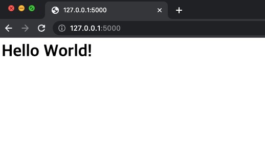
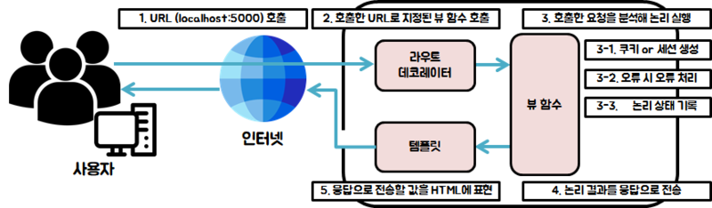

# Flask

## 플라스크란

플라스크란 파이썬 기반 마이크로 프레임워크이다. 마이크로 프레임워크란 풀 스택 프레임워크와 반대되는 개념으로 공식 플라스크에서는 아래와 같이 플라스크를 정의한다.  
> *마이크로는 여러분의 웹 애플리케이션의 하나의 파이썬 파일로 개발해야 한다는 걸 말하는게 아니며, 기능적으로 부족하다는 걸 의미 하지도 않는다.*

플라스크에서 이야기하는 마이크로 프레임워크의 `마이크로`는 핵심기능은 간결하게 유지하되 필요한 기능을 손쉽게 확장할 수 있게 하는 것을 목적으로 한다.   기존 파이썬 2버전에서 작동되도록 개발되었지만 파이썬 3버전에서도 작동 되도록 저 수준 API가 모두 변경돼 있다. 파이썬만 작동 된다면 어느 운영체제에서도 사용할 수 있다.

## 플라스크 특징
플라스크 WSGI 구현체인 Werkzu와 Jinja2로 구성되어 있다. 
- WSGI : Web Server Gateway Interface, 애플리케이션 컨테이너 역할을 정의한 파이썬 표준
- WSGI는 HTTP 웹 요청을 받아 응답하는 애플리케이션에 대한 규격이다.  

플라스크는 아래 기능들을 지원한다.
- 개발용 서버와 디버거 내장
- 단위테스트와 통합 지원
- Restful 요청 처리
- Jinja2 템플릿 엔진 내장
- 안전한 쿠키 지원
- 100% WSGI 1.0 호환
- 유니코드 기반
- 광범위한 문서 제공
- 구글 앱 엔진 호환
- 원하는 기능을 추가하여 확장 가능

## 플라스크를 사용해 웹 페이지에 문자열 출력하기 

```python
from flask import Flask
# Flask 객체를 app 변수에 할당
# Flask 함수로 Flask 객체를 할당, 객체로 모든 플라스크 기능 사용 가능.
app = Flask(__name__)

# app 객체를 이용해 라우팅 경로를 설정
# 어플리케이션의 루트 경로(/)를 호출 했을 때 함수가 실행되게 설정
@app.route("/")
# 해당 라우팅 경로로 요청이 오면 실행할 함수 정의(문자열 출력)
# 뷰함수(특정 URL을 호출했을 때 호출되는 함수)에 속한다.
def hello():
	return "<h1>Hello World!</h>"

# 메인 모듈로 실행될 때 플라스크 서버 구동
# 파이썬에 인터프리터에 의해 메인 모듈로 실행됐는지 확인 후 앱 실행
if __name__ == "__main__":
	app.run()
```
코드를 실행하면 로컬호스트 루프백 IP인 127.0.0.1의 플라스크 기본 포트 번호인 5000번으로 서버가 실행된다.  
 · Serving Flask app "hello" (lazy loading) : 플라스크 앱인 "hello"을 옮겨 로딩. (파일 이름이 hello.py 이니)

  · Environment: production : 환경에 대해 명시. 경고 메시지는 개발 서버이니 배포에 사용하지 말 것 당부.

  · * Debug mode: off : 디버그 모드가 활성화 되어있지 않음.

  · * Running on http://127.0.0.1:5000/ (Press CTRL+C to quit) 

    - 해당 주소로 서버가 활성화 되어있음. Ctrl + c 키나 quit를 입력하면 서버가 중단됨.

    - 이후로 서버 로그가 나옴. 로그는 [url] - - [시각] "요청" [HTTP 코드] - 의 형태



## 플라스크 어플리케이션

1. 플르스크는 특정 URL이 호출되면 실행된다.
2. 특정 URL이 호출되면 그 URL에 매핑된(대응하는) 함수가 실행된다. 
3. 요청한 URL이나(HTTP GET요청을 통해 가져올 글 요청), 내용(HTTP POST 요청을 통해 내용 요청)을 분석해 비즈니스 로직인 논리를 실행한다.  이때, 상황에 따라 요청의 상태를 유지할 경우 쿠키나 세션을 사용한다. 또한 프로그램의 상태를 기록하기 위해 로깅을 하고 오류가 발생한 경우에 처리할 로직을 별도로 제공할 수도 있다.  
4. 논리가 처리되면 결과를 응답으로 템플릿에 반환한다.
5. 응답으로 전송할 값을 HTML에 표현한다. 