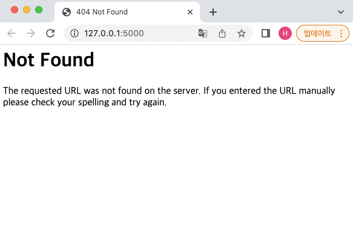
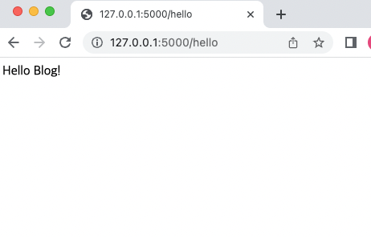
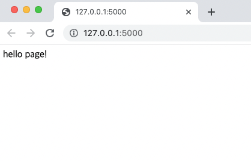
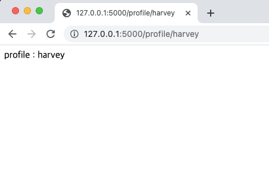
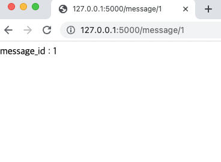

# 플라스크 라우팅
플라스크는 복잡한 URL을 쉽게 함수로 연결하는 방법을 제공한다.  
직접 URL을 지정해 사용하거나 동적으로 변화되게 만들 수 있다. 해당 기능인 `route(라우팅)`에 알아보자

## 플라스크 정적 페이지 라우팅
플라스크는 복잡한 URL을 쉽게 함수로 연결하는 방법을 제공한다. 해당 기능인 route()함수를 사용해 쉽고 빠르게 원하는 URL를 처리하는 기능을 만들 수 있다.    

다음 코드는 localhost:5000의 루트(url 뒤/, /는 생략가능)로 접속하면 함수가 실행 된다.

```python
from flask import Flask
app = Flask(__name__)

@app.route('/')
def hello_flask():
    return 'Hello Blog!'

if __name__ == '__main__':
    app.run()
```
하위 경로를 만들어 함수가 실행되게 해보자. /hello 경로로 들어가야만 함수가 실행되게 route 설정을 변경한다.

```python
from flask import Flask
app = Flask(__name__)

@app.route('/hello')
def hello_flask():
    return 'Hello Blog!'

if __name__ == '__main__':
    app.run()
```
그러면 기존 루트 경로에서는 연결된 함수가 없어 페이지를 찾을 수 없다.  
   

하지만 `/hello` 경로로 들어가면 연결된 뷰함수가 실행되어 지정한 문자열이 출력된다.    
   

## 플라스크 동적 페이지 라우팅
직접 URL을 지정하는 것이 아닌 상황에 따라 다른 URL로 변화하는 동적 적용도 가능하다.  
또한 여러 URL을 한 함수에 적용할 수도 있다. URL에 동적인 변수를 사용하려면 원하는 위치에 `"<변수>"`형태로 추가한다. 해당 변수는 URL과 일치하는 뷰 함수의 인자로 사용할 수 있다.    

<br/>

코드에서 동적으로 변경되는 부분은 인자로 전달될 username변수에 해당 한다. URL의 끝점(endpoint)으로 추가된 username은 해당 URL과 일치하는 뷰 함수인 get_profile 함수의 인자로 들어가 함수 내에서 사용된다.    

```python
from flask import Flask, url_for
app = Flask(__name__)

@app.route('/')
def hello():
    return 'hello page!'

if __name__ == '__main__':
    with app.test_request_context():
        print(url_for('get_profile', sername = 'flask'))
        app.run()
```
test_request_context() 함수를 사용해 url_for 함수에서 반환되는 url을 확인한다. 코드 실행 시 username에 flask를 줬을 경우 반환하는 url을 출력하는데 /profile/flaks가 출력 되었다.   
아래는 메인 페이지 접속시 띄워지는 페이지이다.  

   

새로 구성한 url이다. 맨 끝에 입력된 문자열에 따라 페이지가 접속된다.   

  

`<변환타입:변수>` 형태로 기입해 문자열이 아닌 다른 형태로 변환할 수도 있다.   
다음 코드는 /message 경로에 숫자 형태로 입력을 받아 출력하며 출력 형태는 파이썬의 포맷팅 구조와 같이 %를 이용해 포맷팅해준다.

```python
from flask import Flask
app = Flask(__name__)

@app.route("/")
def hello():
	return "Hello Page!"

@app.route('/profile/<username>')
def get_profile(username):
    return 'profile : ' + username

@app.route('/message/<int:message_id>')
def get_message(message_id):
    return 'message_id : %d' % message_id

if __name__ == "__main__":
		app.run()
```

  