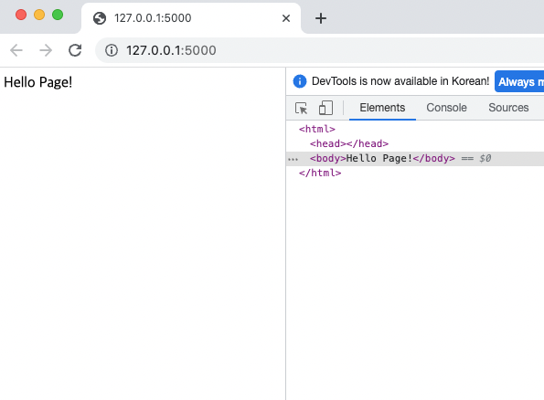

# 플라스크 랜더링
- 웹은 크게 사용자에게 보여지는 프론트엔드와 프론트에서 요청한 내용을 처리하는 백엔드단이 있다.
- 플라스크는 장고와 달리 마이크로 프레임워크기 때문에 프론트엔드와 백엔드를 동시에 처리하지 못한다.
- 플라스크 요청을 처리하는 등 서버의 백엔드만 담당하며 사용자에게 보여지는 부분은 프론트엔드 언어를 사용해야한다.
- 웹 페이지에서 주로 보여지는 부분인 HTML 언어를 알아보고 플라스크에서 활용면을 살펴본다. 


## HTML
HTML : 하이퍼텍스트 마크업 언어(HyperText Markup Language), 구조적 웹 문서를 만들 수 있는 언어로 태그 단위로 제어한다.   
너무 간단하고 태그로만 이뤄진 스크립트라는 등의 이유로 프로그래밍 언어의 범주에는 속하지 않지만, 웹을 구축하기 위해서는 꼭 알아야 할 언어이다.   

HTML 언어로 구조화하여 문자열을 출력하는 법은 다음 코드와 같다.

```html
<!doctype html>
<html>
  <head>
    <title>Hello HTML</title>
  </head>
  <body>
    <p>Hello World!</p>
  </body>
</html>
```
### 특징과 문법 
- 태그 구조 : 시작 태그와 종료 태그가 한 묶음이며 종료 태그에는 `/`가 붙는다.
- 문서의 시작 : 문서의 시작은` <html>`이다. 이는 문서가 html 문서임을 표시하는 것이다.
- 주석 : 일종의 개발자들의 설명줄. 코드에 영향을 주지 않는다. **html에서는 <! 내용>으로 표기한다.**
- 코드 구조 : html은 `<head>`와 `<body>` 구조로 나뉜다.
    - `<head>`는 문제 제목과 같은 보충 정보
    - `<body>`는 실제 브라우저 표시 내용 (웹 문서의 본문)
    - `<title>` 태그는 브라우저의 윗부분인 제목을 설정하는 것.
    - `<h1~6>` 태그는 표제로 `<h1>~<h6>`까지 숫자가 커질수록 글씨가 작아진다.
    - `<p> `태그는 단락(문장) 변경을 의미한다.
    - `<br>` 태그는 줄 바꿈을 의미한다.
    - `<center>` 태그는 가운데 정렬을 의미한다.

이 외에도 다양한 태그가 존재한다.  

간단히 플라스크를 사용해 만든 웹 페이지에 접속해보자.   

웹 페이지에 접속해 f12  키를 누르면 페이지 소스를 볼 수 있다. 파이썬에서 입력한 문자열이 HTML코드로 자동 반영되어 들어가 있다.  

```python
from flask import Flask
app = Flask(__name__)

@app.route("/")
def hello():
	return "Hello Page!"

if __name__ == "__main__":
		app.run()
```
