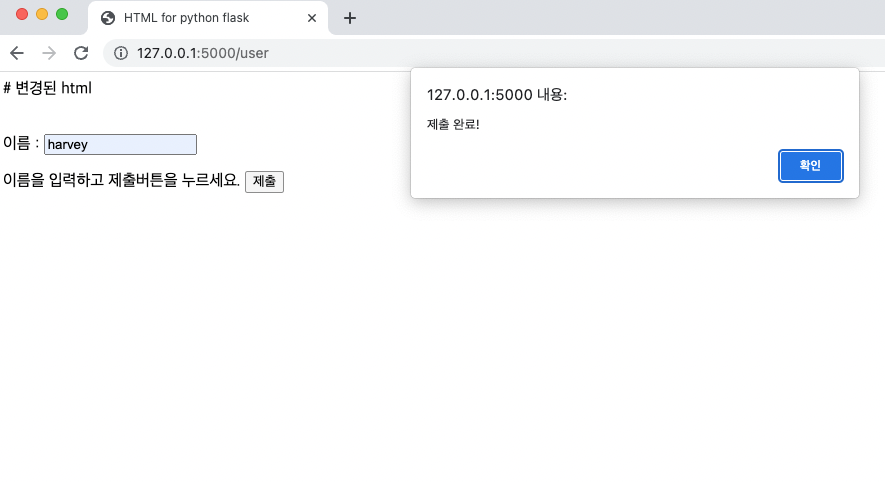

# 플라스크 GET/POST

- 플라스크가 제공하는 기능 중 하나인 요청과 응답을 알아보자
- GET 요청과 POST 요청을 살펴본다. 그리고 HTTP 메소드 개념을 학습한다.  
  

## HTTP 메소드
어떤 방식으로 웹 어플리케이션 페이지를 개발하더라도 가장 기본적이고 필수적인 처리 과정은 **요청을 받아 적절히 처리하고 그 결과로 응답을 주는 것**이다.  

가장 먼저 처리해야 하는 것은 HTTP 요청으로 넘어온 데이터를 어떻게 받아 처리하는지다. 이와 관련해 HTTP 메서드를 먼저 알아보자.    

<br/>  

모든 컴퓨터 서비스는 인터넷 통신 규약인 프로토콜의 하나를 사용해 통신한다. 웹 사이트의 URL은 그 중 http와 https 프로토콜을 사용한다.   

기존에는 http프로토콜이 사용되었으며 점차 보안을 위해 보안 기능이 탑재된 https 프로토콜을 사용하기 시작한다.  
이는 WWW(world wide web)에서 데이터 통신을 하는 근간이다. 명시된 URL에 데이터를 탐색하는 메서드가 프로토콜에 정의되어있다.  

HTTP 메서드는 다음과 같이 존재한다.  

|GET|리소스 취득|DELETE|파일삭제|
|---|----|---|---|
|POST|엔티티 바디 전송|TRACE|경로조사|
|PUT|파일 전송|CONNECT|프록시에서의 터널링 요구|
|HEAD|메시지 헤더 취득|OPTIONS|응답 가능 메소드 요청|


[HTTP 메소드 좀 더 알아보기](https://github.com/parkchanghyup/Flask_exam/blob/main/HTTP.md)

서버에 요청을 보내 응답을 받기 위해서는 `GET` 혹은 `POST` 방식으로 요청한다.  

## 플라스크 GET 요청

플라스크에서 요청에 대한 정보는 request에 담겨있고 객체는 안전을 보장한다. 파이썬에 존재하는 `requests` 모듈이 아니라 플라스크 프레임워크에 존재하는 `request`를 불러와 사용해야 한다.     

이 request 모듈에는 HTTP 메서드에 대한 정보를 얻을 수 있는 method와 GET 방식으로 URL에 인자를 `key=value`형태를 전달했을 때 그 인자를 참조할 수 있는 args, POST나 PUT 방식의 HTML 폼 데이터를 얻을 수 있는 form 속성이 있다.  

GET 방식의 경우 **모든 파라미터를 url로 보내 요청하는 방식**이다. url에 파라미터로 값을 입력하기 위해 사용한다. url에 파라미터로 값을 넣는 방법은 **?를 붙이고 키=값의 쌍 형태로 넣으면 된다.**  파라미터를 추가하고자 할 때는 &를 붙인 뒤 동일하게 추가한다.   

<br/>  
  
`http://localhost:5000/?name=harvey&age=28`  
코드로 request의 args를 활용한 GET 방식 요청을 살펴보자.  
```python
from flask import Flask
from flask import request

app = Flask(__name__)

@app.route('/')
def user_juso():

    temp = request.args.get('name','harvey')
    temp1 = request.args.get('age', '28')

    return temp + '-' + temp1

if __name__ == '__main__':
    app.run()
```


harvey의 나이는 28살이다.

# 플라스크 POST 요청  
POST 요청은 눈에 파라미터가 보이는 GET 요청과 달리 전달하려는 정보가 **HTTP body에 포함**되어 전달된다.  

- GET 요청 : URL 파라미터
- POST 요청 : 전달하려는 정보가 HTTP body에 포함.
전달하려는 정보는 Form Data, Json strings 등이 있다. 이에 따라 사용하는 경우가 다르다.  
- GET 요청 : 작은 양의 데이터를 보낼 때
- POST 요청 : 데이터 양이 많을 때

POST 요청은 주로 입력창에서 발생한다. POST 요청 실습은 지난번에 구성했던 HTML 파일을 이용한다. 
단, POST 요청 실습을 위해 HTML 코드를 살짝 변경한다. 


```html
# 변경된 html
<!DOCTYPE html>
<html>
<head>
	<meta charset="UTF-8">
	<title>HTML for python flask</title>
</head>

<body>
	<form action="/post" method="post">
	​	<p>이름 : <input type="text" id="input" name="input"></p>
		<p>이름을 입력하고 제출버튼을 누르세요. <input type="submit" value="제출" onclick="alert('제출 완료!')" /></p>
	</form>
</body>
</html>
```
변경한 코드는 버튼을 클릭하면 post 메서드를 통해 /post url로 접근하도록 변경한 것이다. 이때 버튼 타입을 submit으로 변경해 값을 제출하도록 했다.  
- form에 action을 /post로 지정해 정보가 전달되는 곳이 action에 지정된 /post url로 보내짐.
- input 입력 태그에 name을 지정해 정보를 전달받으므로 name 값 지정은 필수이다.
- submit은 form안에서 작성한 내용을 통째로 서버로 보내겠다는 의미.
- value는 버튼에 들어갈 값. 기본값은 '제출'

```python
#변경된 코드
from flask import Flask, render_template, request

app = Flask(__name__)

@app.route("/")
def hello():
	return render_template('input.html')

@app.route("/post",methods=['POST'])
def post():
	value = request.form['input']
	msg = "%s 님 환영합니다." %value
	return msg

if __name__ == "__main__":
		app.run()
```
<br/>  

**코드 동작 순서**   
1. 모듈 호출 및 루트 접근 시 작성한 html 파일 호출
2. /post 주소로 post 메서드를 통해 요청이 들어오면 메시지 호출

<br/>  


이름 입력란에 이름을 입력하고 제출 버튼을 누르면 '제출 완료' 알림이 뜬다.  
  
알림 확인 버튼을 누르면 /post url로 이동하며 입력한 값과 함께 환영문구가 출력된다.  
  
이름 입력 후 버튼을 누르는 post 요청없이 바로 url에 접속하는 get 요청을 통해 주소에 접속하면 메서드가 허용 되지 않았다는 메시지가 나온다.  
  

## GET과 POST 능동처리
해당 부부네 대한 예외처리로 링크에 접속했을 때 각 요청에 따라 페이지를 처리하게 할 수 있다.  
코드를 변경해 한 주소에서 각 메서드의 요청을 처리하게 된다.  

```python
from flask import Flask, render_template, request
app = Flask(__name__)

@app.route("/")
def hello():
	return 'main page 입니다.'

@app.route("/post",methods=['GET','POST'])
def post():
	if(request.method == 'GET'):
		return render_template('input.html')
	elif (request.method == 'POST'):
		value = request.form['input']
		return render_template('default.html', name = value)

if __name__ == "__main__":
		app.run()

```
코드를 수정후 html 또한 수정해줘야 한다. 

```html
# 변경된 html
<!DOCTYPE html>
<html>
<head>
	<meta charset="UTF-8">
	<title>HTML for python flask</title>
</head>

<body>
	<form action="" method="post">
	​	<p>이름 : <input type="text" id="input" name="input"></p>
		<p>이름을 입력하고 제출버튼을 누르세요. <input type="submit" value="제출" onclick="alert('제출 완료!')" /></p>
	</form>
</body>
</html>
```  

    
    
    
    
