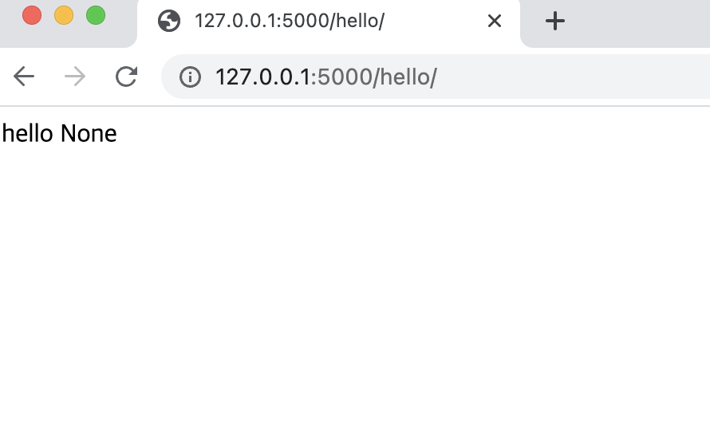
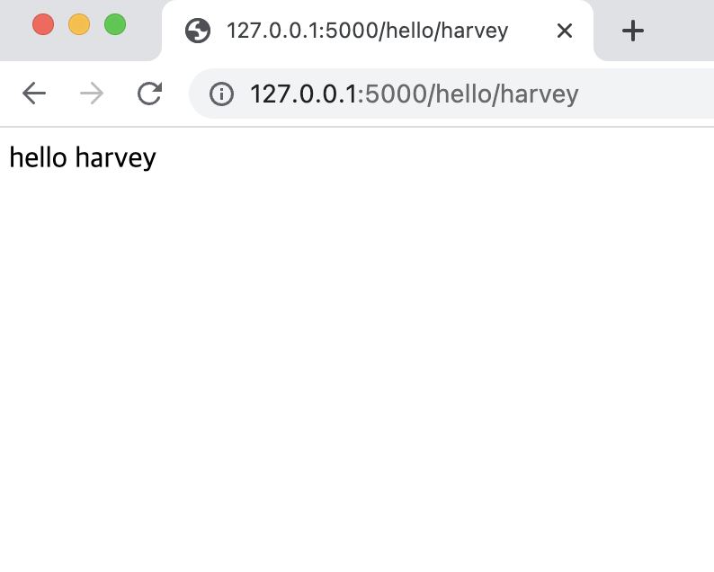

# Jinja2 템플릿
- 플라스크는 사용자의 웹 요청에 대해 `route()` 로 처리하고자 하는 뷰 함수를 호출한다.
- 이때 호출 결과로 적절한 응답을 보내야 한다.

## 정적 파일과 템플릿

**코드 파일 구성의 경우**  
- 일반적인 웹 애플리케이션 : HTML/CSS(프론트엔드) + 자바스크립트, PHP(백엔드)
- 플라스크 : HTML/CSS(프론트엔드) + 자바스크립트, 파이썬 플라스크(백엔드)

**뷰 함수에 대한 응답의 경우**  
- 일반적인 웹 애플리케이션 : 웹 서버 설정으로 지정한다.
- 플라스크 : 생성한 패키지 폴더에 포함하거나 모듈 바로 옆 static 폴더를 만들면 /static에서 정적 파일 접근 가능.

url_for()의 첫 인자로 'static' 끝점을 넘기고 다음 인자로 filename에 정적 파일명을 주면 사용할 정적 파일 호출.

```python
url_for('static', filename = 'style.css')
```

위 함수의 결과는 다음과 같다.
```html
/static/style.css
```
**동적 HTML 구성**
Jinja2 템플릿 엔진은 CSS, 이미지, 처리 데이터를 화면에 보여주기 위한 동적 HTML을 구성하고 그 과정에서 발생하는 특수문자 처리, 웹 보안 등도 처리한다.   

<br/>

HTML 렌더링 과정에서 HTML 템플릿을 이미 간단히 다뤄본적이 있다. `render_template()` 함수를 이용해 HTML로 작성한 파일을 불러오는 방식이다. 다음 예제는 `input.html`을 불러오는 코드다.

```python
from flask import Flask, render_template
app  = Flask(__name__)

@app.route("/")
def hello():
	return render_template('input.html')

if __name__ == "__main__":
	app.run
```

다음 예제는 단순히 불러오는 것 말고 동적 구성을 위해 값을 넘기면 HTML에서 처리하는 동적 HTML을 구성한다. 
```python
# 동적 HTML 구성, 넘기는 값에 따라 페이지 출력 값이 다르다.

from flask import Flask, render_template
app = Flask(__name__)

@app.route('/hello/')
@app.route('/hello/<name>')
def hello(name=None):
	return render_template('hello.html', name = name)

if __name__ =='__main__':
	app.run()
```


인자를 넘기지 않으면 None으로 표시.  
  

인자로 넘기는 값을 출력하게 HTML 코드를 JinJa2 템플릿이 처리 

  

## JinJa2 템플릿 문법

1. 주석  
{#  
주석처리할 코드  
#}

2. 공백  
기본적으로 Jinja2는 줄 끝 개행 문자를 제외한 공백(탭, 공백문자, 개행 문자)은 제거하지 않는다.  
- keep_trailing_newline : 줄 끝 개행 문자 유지
- trim_blocks : 템플릿 태그 뒤 첫 개행 문자 자동 제거
- lstrip_blocks : 템플릿 태그가 나오기 전 탭과 공백 문자 제거

```html
<ul>
	<li><a href = "https://ariz1623.tistory.com/">컴퓨터 블로그</a></li>
</ul>
```

- 템플릿 시작 태그에 +를 붙이면 태그 앞 공백을 제거.
- 시작 태그나 종료 태그에 -를 붙이면 태그 시작과 끝 공백 제거
- 위와 같은 +,-를 사용했다면 태그와 기호 사이 공백이 없게 해야 함. (중복 불가)

```html
 <ul>
    
	<li><a href="{{ user.href }}">{{ user.caption }}</a></li>
    
  </ul>
```
3. 이스케이핑
- 어떤 조건이나 환경에서 특별한 구문이나 의미로 해석되는 문자열의 의미 제거
- 다음은 JinJa2 템플릿에서 변수의 값을 출력하는데 사용하는 변수 구분자인 '{'를 이스케이핑 한다.

```java
{{ '{{' }} // 구분자에 따옴표를 붙여 문자열 처리
```

더 큰 범위는 raw 구문을 사용 한다.  

```html

	<이스케이핑할 문자열>

```
4. 반복문
- 일반적 for문 과 구조가 비슷함. 
- 예제로 가져왔던 다음 반복문에서 users는 리스트 형태의 변수로 user 객체를 담고 요소를 in 구문을 사용해 가져온다. href과 caption 속성은 {{...}}를 사용해 출력한다. 

```html
<ul>
    
	<li><a href="{{ user.href }}">{{ user.caption }}</a></li>
    
  </ul>
```
for 구문 안에는 템플릿 엔진이 제공하는 특별한 변수를 사용할 수 있고 다음 표가 해당 목록이다. 


|변수|설명|
|---|----|
|loop.index|for 구문이 현재 반복한 회수 (1부터)|
|loop.index()|for 구문이 현재 반복한 회수 (0부터)|
|loop.revindex|for 구문이 현재 반복한 회수 (1부터)|
|loop.first|반복이 처음 실행되면 True, 아니면 False|
|loop.last|반복이 마지막이면 True, 아니면 False|
|loop.length|전체 반복 횟수|
|loop.cycle|loop.cycle() 함수의 인자로 넘기는 리스트 항목 순서대로 전달.|

일반적 구문  

```html

	<코드>
<% endfor %>
```


5. if 조건문  
if 구문으로 변수나 변수 이용 표현이 들어가고 변수의 존재 여부나 변수 값 혹은 결과값의 참 거짓 값을 판단해 구성.

일반적인 if  구문
```java

<코드>

<코드>

```
인라인으로 다른 구문과 같이도 사용 가능하다
```java

```
인라인 예시
```java

<li>{{ user.username }}</li>
<% endfor %}
```
6. 매크로(macro)
- 반복적 사용 코드에 대해 반복 작업을 줄이고 템플릿 코드 재사용, 일반적으로 아래 형식.
```java
{% macro <매크로 이름>(매크로 인자, ...) % }
<코드>

```
사용예시를 살펴보자
```html
{% macro <매크로 이름>(매크로 인자, ...) % }
<코드>

```
위 HTML 코드를 매크로를 사용하면 다음과 같이 된다.

```html
{% macro input(name, value="",type='text') -% }
<input type="{{ text }}" name="{{ name }}" value="{{{value}}">

```
필요한 곳에서 다음처럼 호출 한다.
```html
{% from 'input.html' import input % }
<p>{{ input('username') }} </p>
<p>{{ input('password', type='password') }} </p>
```
7. import  
매크로 : 템플릿에서 반복적으로 사용하는 코드 정의 및 재사용  
import : 다른 템플릿 파일 내용을 가져옴. 다른 파일에 있는 매크로를 가져올 때도 사용.

<br/>  

다음 두 가지 방법으로 사용.

```html



{{ <매크로 참조 변수> }}
````

​

이외 extends, include가 있고 각 부모템플릿 참조, 다른 템플릿 내용 포함이다. 

include는 한 템플릿에 헤더와 푸터 템플릿을 넣기 위해 사용한다.