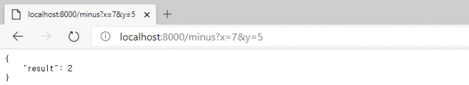

# Restful API 개념과 예제 
## 기본 개념
Flask : 파이썬의 경량 마이크로 웹 프레임워크
<br/>  

REST : Representational  State Transfer의 약자로 자원을 이름으로 구분하여 주고 받는 모든 것을 의미한다.  
- 상세 : HTTP URL로 자원을 명시하고 HTTP Method로 자원의 CRUD 오퍼레이션을 적용하는 것을 의미한다.  
- 장점 : HTTP 표준 프로토콜에 따르는 모든 프로토콜에서 사용 가능하며 디자인 문제 최소화, 서버와 클라이언트 역할 분리 등이 있다.
- 단점 : 구형 브라우저가 모든 메서드를 지원하지는 않아 사용할 수 있는 메서드가 제한적이다.  
- 특징 
	1. 서버와 클라이언트 구조다.
	2. 무상태, 클라이언트 context를 서버에 저장하지 않아 구현이 단순해지며 클라이언트 요청만 단순 처리한다. 
	3. 캐시 처리가 가능하다.
	4. 계층화, 클라이언트는 REST API 서버만 호출하며 다중 계층으로 구성될 수 있다.

<br/>  
  
- REST API : REST 기반 API서비스, 최근 누구나 사용할 수 있도록 공개된 OPEN API등 제공업체가 사용한다. 
- RESTful : REST 아키텍처를 구현하는 웹 서비스를 나타내기 위한 용어, REST 원리를 따르는 시스템 지칭
- RESTful 하지 못한 경우? : CRUD 기능을 모두 POST로 처리, route에 리소스와 아이디 외 정보가 들어가는 경우

### REST API설계 기본 규칙
REST API는 도큐먼트, 컬렉션, 스토어로 구성 되어 있다.  
- 도큐먼트 : 데이터베이스 레코드
- 컬렉션 : 서버에서 관리하는 리소스, 디렉터리
- 스토어 : 클라이언트에서 관리하는 리소스 저장소

### REST API 설계 규칙 
1. 슬래시 구분자(/)는 계층 관계를 나타내는데 사용한다.
2. URI 마지막 문자로 슬래시(/)를 포함하지 않으며 URI 경로의 마지막에는 슬래시(/)를 사용하지 않는다.  
3. 하이픈(-)은 URI 가독성을 높이는데 사용한다. 
4. 언더바(_)는 URI에 사용하지 않는다. 
5. URI 경로에는 소문자가 적합하다.
6. 파일확장자는 URI에 포함하지 않는다.
7. 리소스 간에는 연간 관계가 있는 경우 `/리소스명/리소스 ID/관계가 있는 다른 리소스명` 으로 표기한다.

## 간단한 RESTful API 

```python
from flask_restful import Resource
from flask_restful import reqparse

class Minus(Resource):
	def get(self):
		try:
			parser = reqparse.RequestParser()
			parser.add_argument('x', required = True, type = int, help = 'x cannot be blank')
			parser.add_argument('y', required = True, type = int, help = 'y cannot be blank')
			args = parser.parse_args
			result = args['x'] - args['y']
			return {'result' : result}
		except Exception as e:
			return {'error' : str(e)}

from flask import Flask
from flask_restful import Api

app = Flask('My First App')
api = Api(app)
api.add_resource(Minus, '/minus')

if __name__ =='__main__':
	app.run(host = '0.0.0.0', port = 8000, debug = True)

```
웹 브라우저를 열고 주소창에 url을 다음과 같이 입력하면 HTTP GET 요청으로 7과 5를 호출해 7에서 5를 뺀 값인 2가 나온다.  

> http://localhost:8000/minus?x=7&y=5

