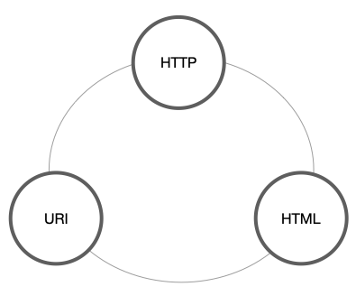

# 프로토콜 : HTTP

## HTTP 프로토콜 개념
HTTP : 하이퍼 텍스트 전송 프로토콜(HyperText Transfer Protocol)은 osi 7계층으로 구분하는 네트워크 상에서 7계층에 해당하는 프로토콜이다.  
웹 상에서 정보를 주고 받을 때 쓰는 프로토콜로서 80번 포트번호를 사용한다. 현재는 보안성이 보완된 https 프로토콜을 사용한다.  

웹 페이지는 클라이언트와 서버가 상호간 요청과 응답을 주고 받으며 다음 일을 진행한다. 각 요청과 응답의 상황에서 벌어지는 일을 살펴본다.   

## HTTP 통신 요청 메서드
요청에서는 http 프로토콜이 통신 중 요청할 때 경우(방식)에 따라 메서드로 분류한다. 

### HTTP 메서드
간략히 말하면 웹을 지탱하는 주요 기술 중 하나다.  웹을 지탱하는 주요 기술들은 다음과 같다. 

- HTTP : Hyper Text Transfer Protocol, 애플리케이션 컨트롤
- URI : Uniform Resource Identifier, 리소스 식별자
- HTML : Hyper Text Markup Language, 하이퍼 미디어 포맷

## HTTP의 기능 
HTTP는 하이퍼텍스트를 전송하기 위한 프로토콜 이지만 실제로는 하이퍼 텍스트 이외의 다양한 것을 전송하고 있고 그것은 리소스 상태의 표현이라고도 정의할 수 있다.

## HTTP 메서드의 정의 
서버에 요청을 보내는 방법이기도 하며 서버에 명령을 내린다고도 한다. 
이 HTTP메소드는 클라이언트에 요청하는 바식에 따라 명령어가 9개 존재한다. 

## HTTP 메서드의 종류

1. GET : 리소스 취득 
- URL에 데이터를 포함시켜 명령을 내림
- 어떤 정보를 가져오기 위한 리소스. GET은 URL에 데이터가 노출되어 있어 보안에는 취약하다. 로그인을 할 때 이 방식을 사용하면 정보가 유출될 수도 있으니 이 경우 GET 방식을 사용해선 안된다. 또 길이 제한이 있고 캐시 될 수 있으며 데이터가 헤더에 포함되어 전달한다.
2. POST : 엔티티 바디 전송
- GET과 유사, 용량은 비제한이나 시간제한이 걸린다.
- POST 방식은 어떤 정보를 제출하기 위한 것이다. 데이터가 본문에 포함되어 전달되고 GET 방식과는 다르게 URL에 데이터가 노출되지 않아 보안에도 유리하다. 또한 길이 제한이 없으며 캐시가 되지 않는다.
3. PUT : 파일 전송
- POST와 유사한 전송 구조를 가지고 있지만 PUT의 경우에는 갱신 위주이다.  
헤더 이외에 메시지(데이터)가 함께 전송이 된다. 원격 서버에 지정한 콘텐츠를 저장하기 위해 사용되며 홈페이지 변조에 많이 악용 되고 있다. 
4. HEAD : 메시지 헤더 조사
- HEAD 방식은 GET과 유사하지만 실제 문서를 요청하는 것이 아니고 웹 서버에서 헤더 정보 이외 어떤 정보도 보내지 않는다. 
5. DELETE : 파일 삭제
- 웹의 리소스를 제거하는 것으로 PUT과는 서로 반대되는 개념이다.
6. TRACE : 경로 조사
- 요청 리소스가 수신이 되는 경로를 보여주는 메소드다. 
- 원격지 서버에 루프백 메시지를 호출하기 위해서 사용된다.  
7. CONNECT : 프록시에서의 터널링 요구
- 웹 서버에서 프록시 서버와 같은 중간 서버를 경유할 때 사용된다. 
8. OPTIONS : 응답 가능 메소드 요청
- 요청된 리소스와 양방향 통신 시작 및 터널 열기
- 가능한 메소드 옵션에 대한 질의이다. 해당 메소드를 통해 시스템에서 지원되는 메소드의 종류를 확인할 수 있다.
- 웹 서버에서 여러 가지 종류의 지원 범위에 대해서 물어보는 것으로 여러 리소스에 대해서 실제로 접근하지 않고도 그것들을 어떻게 접근하는 것이 가장 최선인지 확인할 수 있는 수단을 클라이언트 어플리케이션에 제공한다.
9. PATCH 
- 리소스의 부분 교체
- 요청 문서에 지정된 모든 리터럴 특성 업데이트
- 모든 로컬 자원 특성은 요청의 해당 특성 값으로 업데이트 되거나 교체됨
- 로컬 자원 특성을 요청의 내용으로 교체 가능.

## HTTP 통신 응답 상태 코드
요청에서 잘 요청하고 응답이 되었는지, 응답이 잘못 받아졌는데 이 문제가 서버의 문제, 클라이언트 문제 및 다른 문제에 따라 HTTP 통신에서 이 응답 상태를 코드로 분류한 것이 HTTP 통신 상태코드다.  

**[전체적 상태 코드]**
|코드|내용|
|---|---|
|1xx|정보성|
|2xx|성공|
|3xx|리다이렉션|
|4xx|클라이언트(사용자)에서 발생한 에러|
|5xx|서버 에러|

**[주요 상태 코드]**
- 200 : 서버가 요청을 제대로 처리했다는 뜻.
- 403 : 서버는 요청을 이해했는데 권한이 없음.
- 404 : 서버가 요청한 페이지를 찾을 수 없음
- 500 : 서버는 요청을 처리하는 과정에서 잘못된 요청을 보호하기 위해 기대하지 않은 조건 응답을 보여줌. 요청 처리 과정에서 잘못된 요청을 보호하기 위해 기대함.
- 502 : 서버의 잘못된 게이트 웨이로 인한 에러
- 503 : 서비스를 사용할 수 없음.
